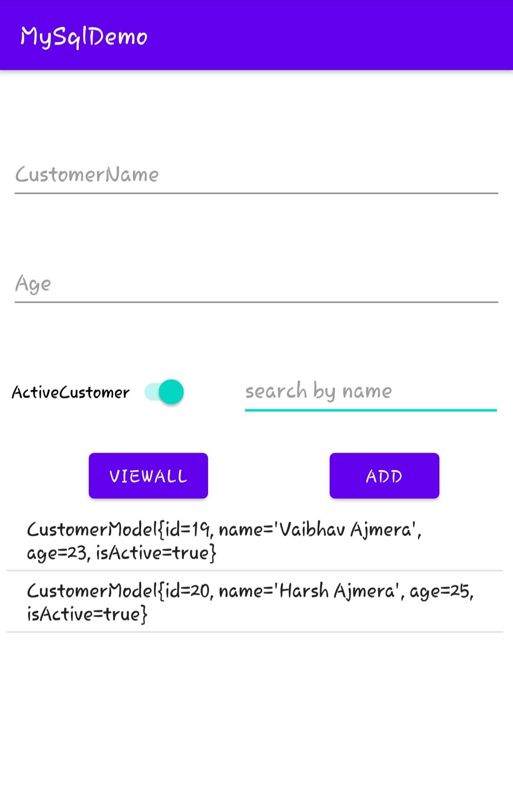
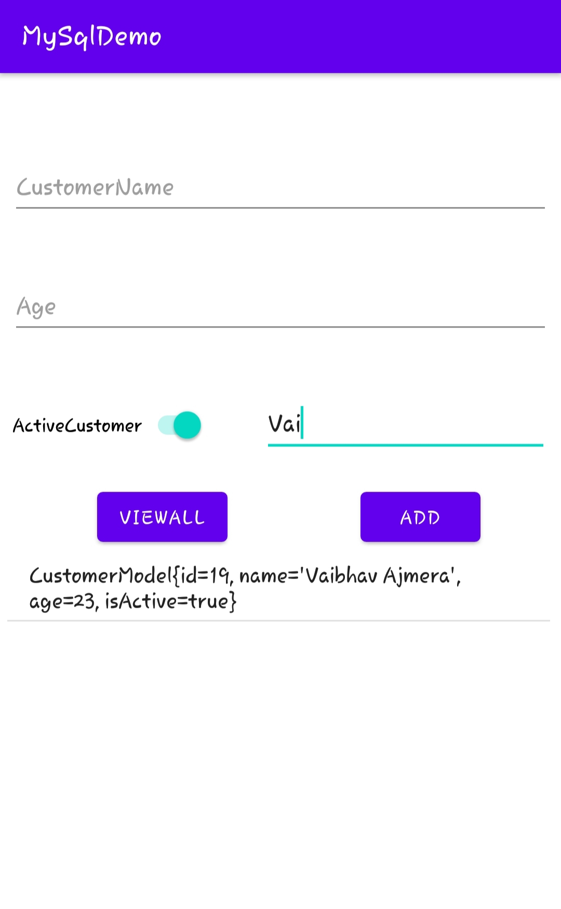

# CRUD
This app demonstrates the basic Create,Read,Update,Delete operations using sqlite database.

Features to be added: To prevent SQL injection in search function, need to use [PreparedStatement](https://docs.oracle.com/javase/tutorial/jdbc/basics/prepared.html) object.

<table>
  <tr>
    <td>UI</td>
    
    
  </tr>
  <tr>
    <td></td>
    
  </tr>
 </table>
  
  

  
 Layout is simply created using XML. An ArrayAdapter also has been used , to display the database.
 

 
   
 

  
  
  

<table>
  <tr>
    <td>AddedUsers</td>
     <td>SearchingUserByName</td>
    
  <tr>
    <td></td>
    <td></td>
    
  </tr>
 </table>

  

This link was very useful for adding search feature https://stackoverflow.com/questions/50157853/how-to-use-wildcards-in-a-sqlite-query
